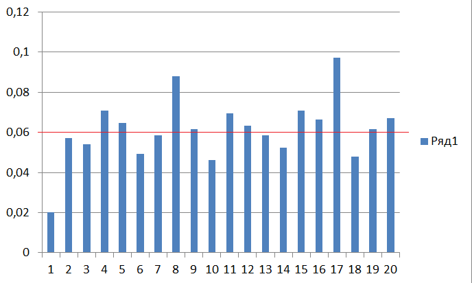
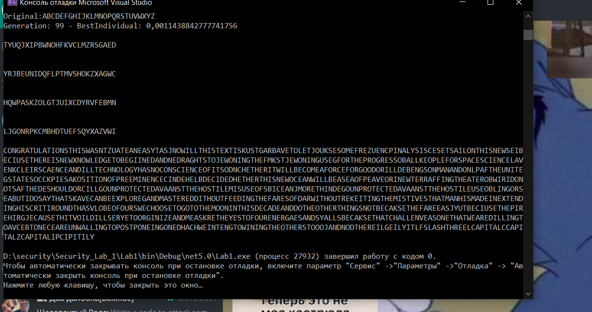

# lAB1
 
## 1

Для початку перевели бітову послідовність у ASCII, скориставшись стороннім сайтом.(На цей процес у нас пішов місяць бо ми намагалися найпереше завдання росшифрувати через XOR і ми ненавидим себе за це).

## 2

Далі для першого завдання ми перевели hex у ASCII а потім використали XORDecoder та використавши регулярний вираз знайшли наш текст
Отримали наступний текст:
Now try a repeating-key XOR cipher. E.g. it should take a string ???hello world??? and, given the key is ???key???, xor the first letter ???h??? with ???k???, then xor ???e??? with ???e???, then ???l??? with ???y???, and then xor next char ???l??? with ???k??? again, then ???o??? with ???e??? and so on. You may use an index of coincidence, Hamming distance, Kasiski examination, statistical tests or whatever method you feel would show the best result.(замість ??? ларки)

## 3

Спочатку знову переводимо текст із BASE64 та переводимо у UTF8. Потім знаходимо індекс співпадіння з чого ми узнали що довжина ключа 3 порівнявши із стандартним індексом англійської мови. Далі вираховуємо ключ та розшифровуємо.
Отриманий кключ: L0l 
Текст: Write a code to attack some simpLe substitution cipher. To reduce the compLexity of this one we wiLl use onLy uppercfse letters, so the keyspace is only 26! To get this one right futomaticflly you wilL probfbly need to use some sort of genetic aLgorithm (which worked the best lfst yefr), simuLated fnnealing or grfdient descent. Seriously, write it right now, you wilL need it to decipher the next one as well. Bear in mind, there's no spaces.
 
## 4

Наступне завдання потребує написання генетичного алгоритму. Початкова популяція в нас 1000. Вибираємо 100 використовуючи до них фітнес в якій ми їх розшифровуємо та порівнюємо з данними із триграми та сортируємо.Далі при схрещуванні отримаємо нащадків у 10000 до яких використовуємо мутацію з визначним віцотком і повторюємо фіксованою кількістю разів.
Текст: ADDTHEABILITYTODECIPHERANYKINDOFPOLYALPHABETICSUBSTITUTIONCIPHERSTHEONEUSEDINTHECIPHERTEXTSHEREHASTWENTYSIXINDEPENDENTRANDOMLYCHOSENMONOALPHABETICSUBSTITUTIONPATTERNSFOREACHLETTERFROMENGLISHALPHABETITISCLEARTHATYOUCANNOLONGERRELYONTHESAMESIMPLEROUTINEOFGUESSINGTHEKEYBYEXHAUSTIVESEARCHWHICHYOUPROBABLYUSEDTODECIPHERTHEPREVIOUSPARAGRAPHWILLTHEINDEXOFCOINCIDENCESTILLWORKASASUGGESTIONYOUCANTRYTODIVIDETHEMESSAGEINPARTSBYTHENUMBEROFCHARACTERSINAKEYANDAPPLYFREQUENCYANALYSISTOEACHOFTHEMCANYOUFINDAWAYTOUSEHIGHERORDERFREQUENCYSTATISTICSWITHTHISTYPEOFCIPHERTHENEXTMAGICALWORDWILLTAKETOTHENEXTLABENJOYBITLYSLASHTWOCAPITALYCAPITALJCAPITALBLCAPITALYCAPITALL

## 5

Це завдання схоже на ппоперднє але воно потребувало переписати генетичний алгоритм змінючи хромосоми на N кількість  алфавітів в одному ключі. Для початку ми використали перерахунок частот.

Можемо побачити закономірність що кількість алфавітів які підійдуть для нашої мови кратна 4. 
Уся логіка таж сама за винятком дешифрування.
Найкращий отриманий результат:

