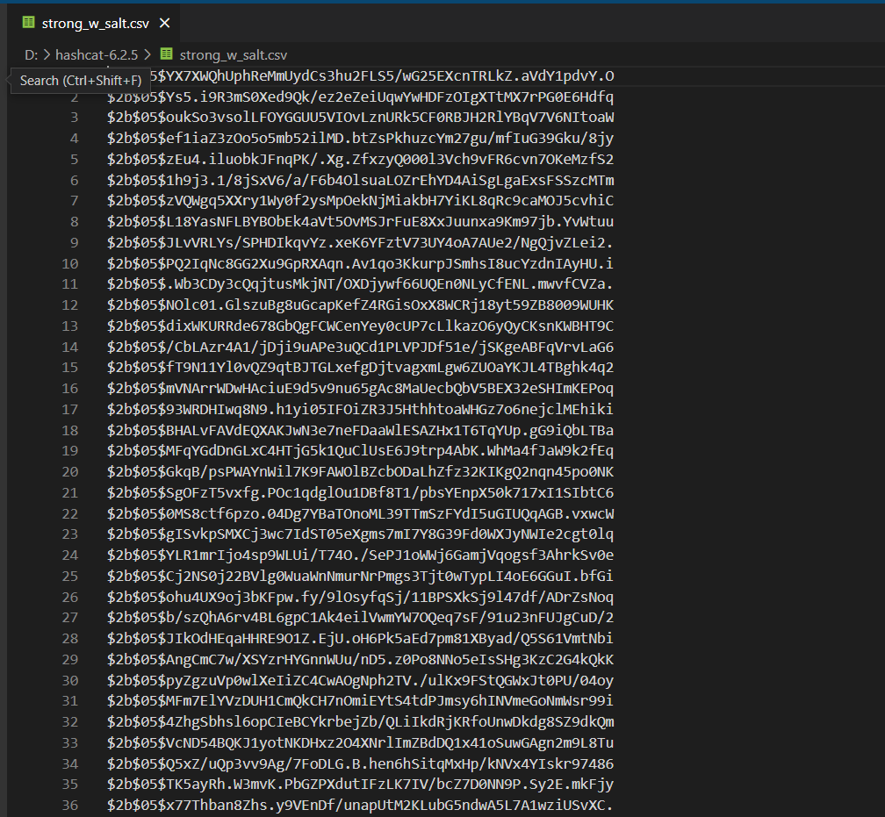

# Pass generator 
## First task
Для цієї лабораторної було обрано файли які здерігали найпопулярніші паролі (топ 100 та топ 1млн), зберігаються ці файли у пацпі Document. Було згенеровано 10000 паролыв 25 самих популярних, 75000 з 1млн, 500 абсолютно рандомних,і 10000 паролів які людина моглаб запам'ятати (обьднанням декількох слів та чисел або генерацією з популярних паролів). Після чого ми їх перемішали щоб деякі паролі дуже сильно не кидалися у очі.

Для меиодів хешування було обранно sha1 + salt, md5 та Bcrypt.
Sha1 - переводимо у байти додаючи сіль (випадковий набір байтів додаємо до ключа)та а отриманий хеш назад переводиться в біти
MD5- метод GetHash класу  повертають хеш у вигляді масиву з 16 байтів.
Bcrypt був згенерований за допомогою бібліотеки BCrypt.Net
## Second task
Ми маємо 2 файли на вході - md5 ,без солі та bcrypt з сіллю
Bcrypt

md5 

Для злому була вибранна утылыта "hashcat",вона швидка та передова для відновлення паролів, що підтримує п'ять унікальних режимів атаки для більш ніж трьохсот алгоритмів хешування.
Взламаємо weakHash.csv через brute-force
hashcat.exe -a 3 -m 0 --force weakHash.csv

Приблизно за 1 години ми змогли взламати 45301 з 70087 при цьому ми перебрали 2447548809216 паролей.

Взламаємо weakHash.csv через dictionary
hashcat.exe -a 0 -m 0 --force weakHash.csv 10-million.txt

Обраний словник це 1млн популярніших паролей обробився він за 1 хвилину обробив 70087 паролей та взламати зміг лише 28517

Тепер спробуємо зламати bcrypt із сіллю через brute-force:
hashcat.exe -a 3 -m 0 --force strong_w_salt.csv

Можемо поачити що за 50 хвилин утилыта перебрала 155230 паролыв та не 1 з них не підійшов

Тепер спробуємо зламати bcrypt із сіллю через dictionary

Можемо побачити що за 10 хвилин ми змогли отримати 9406 паролів.

## Як результат 
MD5 не рекомендований для зберігання паролей томущо він має дуже високу швидкість перебору. Також серед мінусів є колізія(можливість досягти однакового підсумкового значення хеша при введенні абсолютно різних даних на вході)
Bcript має дуже великий час перебору порівняно з MD5 та проте при сильних обчислювальних потужностях він теж легко перебирається.

